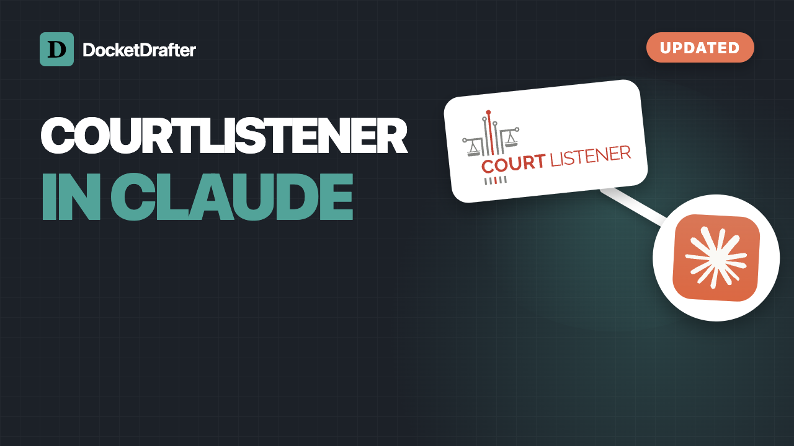
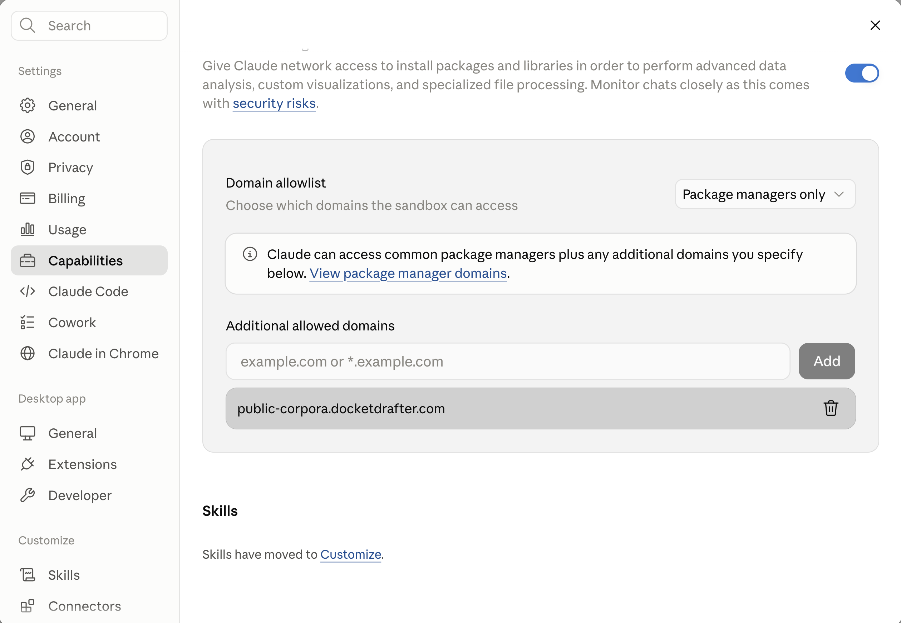

  

<h1 align="center">DocketDrafter Legal Research Tools for Claude</h1>

  Free, open-source tools for researching statutes, court rules, cases, and dockets in Claude

## Choose what you need

| If you want to research… | Install… | API key required? |
|---|---|---|
| Cases, opinions, and RECAP dockets | CourtListener by DocketDrafter | Yes—a free CourtListener key |
| Statutes and court rules | One or more DocketDrafter marketplace plugins | No |

You can install either option or both. They work independently.

## Cases and dockets: CourtListener

CourtListener by DocketDrafter searches opinions and RECAP dockets, downloads public court
materials, and saves the results in a research library on your computer.

### Install the extension

1. Get a free API key from [CourtListener](https://www.courtlistener.com/profile/api-token/).
2. [Download `courtlistener.mcpb`](https://github.com/DocketDrafter/docketdrafter-plugins/releases/latest/download/courtlistener.mcpb).
3. Double-click the downloaded file. If macOS asks which application to use, choose **Claude**.
4. Click **Install**, paste your API key, and choose where to save your research. The default is
   `Documents/CourtListener Library`.
5. Save and enable the extension, then start a new conversation.

After updating the extension, quit and reopen Claude before starting a new conversation.

  

[Watch the installation and use tutorial on YouTube →](https://youtu.be/yw3V6mhgk1U)

## Statutes and court rules

### 1. Allow legal-library downloads

Before using these plugins, open **Claude Settings → Capabilities → Domain allowlist**. Then either:

- Add `public-corpora.docketdrafter.com` under **Additional allowed domains** (recommended); or
- Change the dropdown to **All domains**.

> [!IMPORTANT]
> Without one of these settings, Claude Cowork cannot download the legal materials and the
> plugins will not work. If **All domains** is already selected, you do not need to add the
> DocketDrafter domain separately.

  

### 2. Add the DocketDrafter marketplace

1. Open **Customize** in Claude Cowork and select **Plugins**.
2. Add a marketplace from a repository.
3. Enter `DocketDrafter/docketdrafter-plugins`.
4. Install and enable the plugins you want.
5. Start a new conversation.

The first time you use a plugin, Claude downloads and verifies its legal library. After that,
the plugin uses the copy installed in that environment.

### Available plugins

| Plugin | Includes |
|---|---|
| **U.S. Code** | Federal statutes |
| **New York Laws** | State statutes, Constitution, NYC Administrative Code, and selected court rules |
| **Florida Laws** | State statutes, Constitution, and statewide court rules |
| **Indiana Laws** | State code and Constitution |
| **Illinois Laws** | Compiled statutes and Illinois Supreme Court Rules |
| **Ohio Laws** | Revised Code and Constitution |
| **Federal Court Rules** | Federal rules and selected district local and ECF rules |

See [Corpus coverage and currency](docs/corpus-coverage.md) for sources, dates, omissions, and
rule-set details.

## Privacy and local storage

- Statute and rules plugins download their legal libraries directly from DocketDrafter's public
  download domain and use the installed copy for later research.
- CourtListener searches go directly from your computer to CourtListener. DocketDrafter does not
  operate an intermediary research server.
- CourtListener opinions and court documents are saved in the folder you select, so you can open
  and reuse them outside Claude.
- Your CourtListener API key is stored by Claude using your operating system's secure credential
  storage; it is not pasted into conversations.

## Important limitations

These tools are research aids, not substitutes for checking authoritative sources. The statute
libraries generally omit annotations, editorial commentary, and some historical material. Local
court-rule coverage is selected rather than comprehensive. Always verify current law, filing
requirements, and deadlines against an official source.

## Other documentation

- [Claude Code installation](docs/claude-code.md)
- [Corpus coverage and currency](docs/corpus-coverage.md)
- [Technical architecture and development](docs/technical-architecture.md)
- [Version-controlled corpus data and builders](https://github.com/DocketDrafter/docketdrafter-plugin-content)

## About DocketDrafter

[DocketDrafter](https://docketdrafter.com) builds practical tools and playbooks that help
attorneys use Claude and other AI systems for legal research, drafting, and document workflows.

Questions, feedback, or ideas for another tool? Email
[tommy@docketdrafter.com](mailto:tommy@docketdrafter.com). For tutorials, visit the
[DocketDrafter YouTube channel](https://www.youtube.com/@DocketDrafter).

## License

These tools are available under the [BSD 3-Clause License](LICENSE).
Copyright © 2026 Avize LLC d/b/a DocketDrafter.
